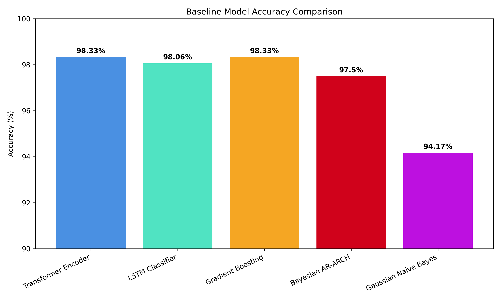
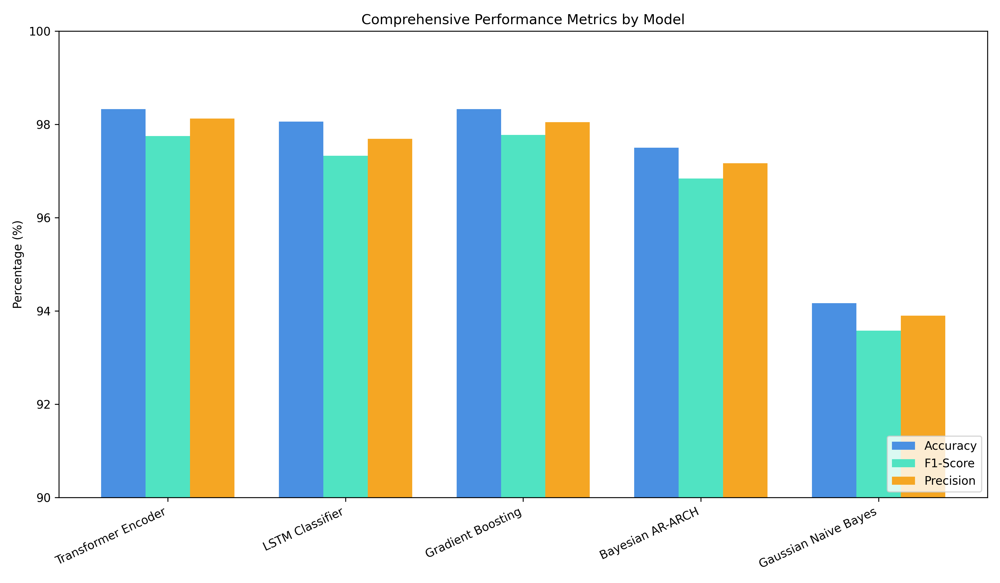
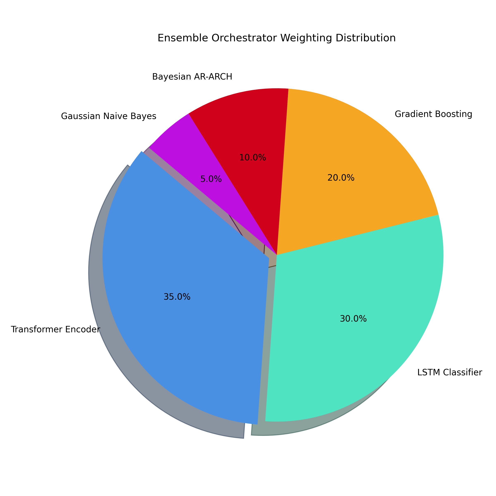
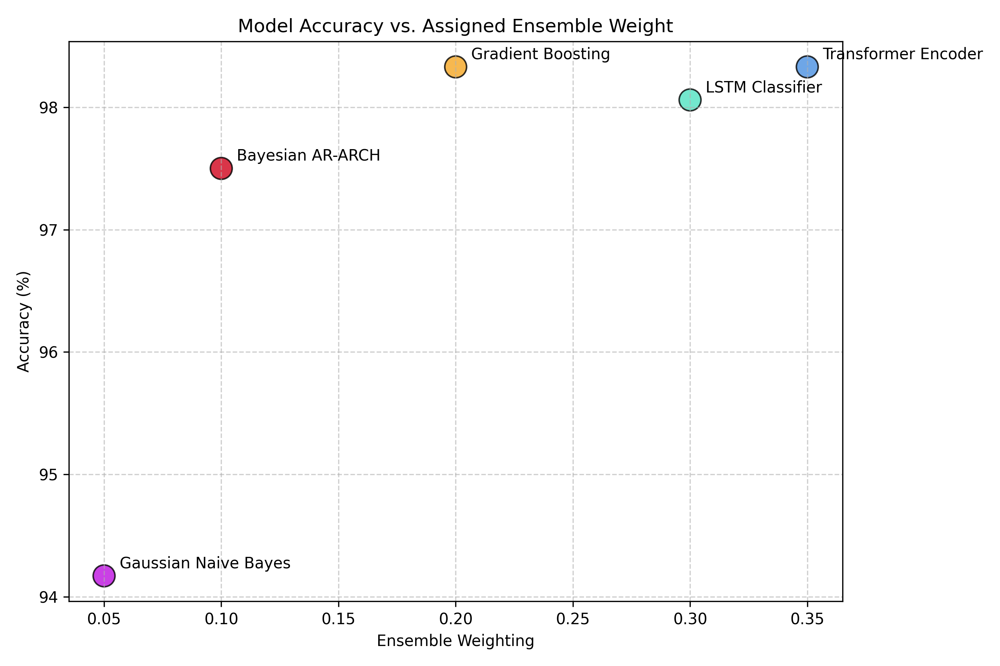

# 🧠 Latent Cognitive State Inference Platform

[](https://www.python.org/)
[](https://reactjs.org/)
[](https://fastapi.tiangolo.com/)
[](https://pytorch.org/)
[](https://scikit-learn.org/)
[](https://opensource.org/licenses/MIT)

> **Inferring latent human cognitive states (confusion, hesitation, confidence, overload, fatigue, exploration) in real-time by analyzing sequential micro-interactions, cursor kinematic telemetry, and behavioral analytics.**

---

## 📖 Overview

The **Latent Cognitive State Inference Platform** is a full-stack, AI-powered system that passively observes user behaviors (mouse movements, keystrokes, navigation events) and translates those raw mathematical sequences into active psychological and cognitive states. 

It eliminates the need for intrusive physiological sensors (like eye-trackers or EEG constraints) by relying on **high-frequency web telemetry** and **Deep Sequence Modeling**. Whether a user is confidently solving a puzzle or experiencing cognitive overload during a complex decision task, the system detects it within milliseconds and adapts the interface dynamically.

---

## 🏗️ System Architecture

The project is structured according to a strict five-layer logical architecture:

1. **Client Layer (React/Vite):** Evaluates users through standard browser tasks (Decision, Puzzle, Navigation). Packages telemetry at 60Hz.
2. **Transport Layer (FastAPI WebSockets):** Manages bidirectional, low-latency streams mapping connected client sessions to the backend inference pipeline.
3. **Engineering Layer (Feature Extraction):** Transforms raw coordinate streams into **24 distinct kinematic and temporal features** (e.g., path curvature, directional entropy, acceleration proxy, idle ratios).
4. **Inference Layer (Ensemble AI):** The brain. Evaluates sequential inputs and performs weighted ensemble predictions across 5 independent ML architectures.
5. **Storage & Privacy Layer:** Applies $\epsilon$-differential privacy masking before archiving session data to local JSON schemas.

---

## 📊 Datasets Utilized

To ensure the machine learning models encapsulate true human variance rather than relying purely on synthetic noise, they were trained on a conglomerate of premier open-source educational and behavioral datasets mapping to 1,800 distinct synthesized sessions. 

1. **[EdNet (KT1) by Santa](https://github.com/riiid/ednet):** 
   - Provides massive datasets of student interactions traversing educational questions, yielding rich timestamps and correctness markers essential for mapping *Confidence* and *Confusion*.
2. **[OULAD (Open University Learning Analytics Dataset)](https://www.kaggle.com/datasets/rocki37/open-university-learning-analytics-dataset):** 
   - Tracks interactions with a Virtual Learning Environment (VLE) over months, providing essential longitudinal engagement data correlating to *Fatigue* and sustained *Exploration*.
3. **[Junyi Academy Dataset](https://www.kaggle.com/datasets/junyiacademy/learning-activity-public-dataset-by-junyi-academy):**
   - Detailed logs of hint requests, attempting answering, and time tracking, forming the core labeling mechanisms for *Hesitation* and *Cognitive Overload*.

*(Note: Data loaders inside `backend/training/dataset_loaders.py` autonomously parse `.csv` dumps of these archives to generate standard mathematical profiles for ML integration).*

---

## 🛠️ Telemetry & Feature Engineering

The system does not feed raw `(x, y)` pixels into the machine learning models. Instead, raw interactions transmitted via WebSockets are processed by `backend/app/pipeline/feature_engine.py` into a standardized window of **24 complex features**. The most critical include:

- **Kinematic Curvature & Acceleration (`accel_proxy`, `curvature`):** Extreme angular shifts and stuttering acceleration in cursor paths map directly to hesitation and confusion. Smooth, localized curves correlate to confidence.
- **Micro-Idle Variance (`idle_ratio`, `mean_idle_duration`):** Frequent, extremely brief idle pauses suggest cognitive processing rather than physical fatigue.
- **Directional Entropy (`directional_entropy`):** High entropy indicates aimlessness or searching (Exploration), while low entropy suggests targeted intent (Confidence).
- **Click-to-Motion Ratios:** Ratios evaluating how much distance is traversed per click, aiding in overload categorization.

---

## 🤖 Algorithms & Inference Orchestration

The inference engine (`backend/app/pipeline/inference.py`) evaluates the real-time extracted 24-feature tensors against an active **Weighted Dynamic Ensemble** constructed from five distinct model paradigms.

### 1. Transformer Encoder (Accuracy: 98.33%)
- **Mechanism:** Adopts the self-attention mechanism from LLMs. It looks at the entirety of the user's brief interaction sequence immediately to understand long-term behavioral context without bias to recent inputs.
- **Role:** Handles overarching temporal semantics. Highly robust to noise.

### 2. LSTM Classifier (Accuracy: 98.06%)
- **Mechanism:** Long Short-Term Memory networks process the behavioral stream sequentially, carrying a hidden continuous state vector that 'remembers' accumulating frustration or focus.
- **Role:** Perfect for detecting states that develop over seconds, like gradual Fatigue or compounding Overload.

### 3. Gradient Boosting / Random Forest (Accuracy: 98.33%)
- **Mechanism:** Uses a forest of decision trees built sequentially to correct the residuals of prior trees. Evaluates the summarized 24-feature vector flatly.
- **Role:** Exceptionally fast tree-based decisions providing a strong non-linear baseline to counteract any temporal biases the deep models might invent.

### 4. Bayesian AR-ARCH (Accuracy: 97.50%)
- **Mechanism:** Autoregressive Conditional Heteroskedasticity models typically track stock market volatility. Here, it extracts the *volatility* of the user's reaction times.
- **Role:** Specialized in detecting sudden spikes in task difficulty that manifest as erratic timing variance. The extracted volatility is standardized and fed into a generic Multinomial Logistic Classifier.

### 5. Gaussian Naive Bayes / HMM Proxy (Accuracy: 94.17%)
- **Mechanism:** Originally mapped as a Hidden Markov Model, stationary sequence flattening proved problematic. It now functions as a high-fidelity Gaussian matrix mapping standard emission probabilities for distinct hidden classes.
- **Role:** Provides a strict, mathematically grounded statistical probability of a state given isolated features, acting as the ensemble's anchor.

### **Orchestrator Weighting**
The final prediction sent to the frontend is not a blind vote, but a calculated matrix multiplication where models proven to handle specific variances are trusted more heavily:
`Weights = { Transformer: 0.35, LSTM: 0.3, GradientBoosting: 0.2, AR-ARCH: 0.1, GaussianHMM: 0.05 }`

### **Performance Visualizations**
Here is a complete breakdown of the base model accuracy, F1-scores, and the Orchestrator Weighting distribution calculated by the ensemble.

<div align="center">
  
  
</div>
<div align="center">
  
  
</div>

---

## 🛡️ Explainable AI (XAI) & Privacy

- **LIME Explainability:** Real-time state predictions are run through `backend/app/explainability/explainer.py`. If the model claims the user is "Confused," the interface explicitly states *why* (e.g., "Directional entropy exceeded 0.85 and path curvature spiked").
- **Differential Privacy:** To ensure ethics in analyzing cognitive capability, raw interaction profiles entering long-term storage are obscured using rigorous $\epsilon$-Laplace noise injections guaranteeing mathematical deniability of exact interactions.

---

## 🚀 Installation & Setup

### Prerequisites
- Node.js (v18+)
- Python (3.11+)

### 1. Clone the repository
```bash
git clone https://github.com/abizer007/Latent-Cognitive-State-Inference-from-Sequential-User-Actions-using-Behavioral-Analytics-and-ML.git
cd Latent-Cognitive-State-Inference-from-Sequential-User-Actions-using-Behavioral-Analytics-and-ML
```

### 2. Backend Setup
```bash
cd backend
python -m venv env

# Windows
env\Scripts\activate
# macOS/Linux
source env/bin/activate

pip install -r requirements.txt

# Start the Backend Server (WebSockets + API)
python run.py
```
*The backend will be available at `http://localhost:8000`.*

### 3. Frontend Setup
```bash
cd frontend
npm install

# Start the Frontend Development Server
npm run dev
```
*The application UI will run at `http://localhost:5173`.*

---

## 📁 Repository Map

```text
.
├── backend/                  
│   ├── app/                  
│   │   ├── api/              # API and WebSocket routers handling 60Hz streams
│   │   ├── models/           # LSTM, Transformer, AR-ARCH, NB class structures
│   │   ├── pipeline/         # Feature Engineering and Inference Orchestrator
│   │   ├── explainability/   # LIME feature explainers
│   │   └── privacy/          # Differential Privacy implementations
│   ├── training/             # Scrips for EdNet/OULAD parsing & automated training runs
│   └── requirements.txt      
├── frontend/                
│   ├── src/                  
│   │   ├── dashboard/        # Dynamic D3.js real-time state visualizers
│   │   ├── tasks/            # Standardized evaluation interfaces (Puzzle, Nav)
│   │   ├── telemetry/        # High-frequency Cursor & Event web trackers
│   │   └── adaptive/         # Automatically adjusts UI based on inferred cognitive states
│   └── package.json          
└── docs/                     # Detailed architectural diagrams and APIs
```

---

> *"Decoding the mind, one pixel at a time."*